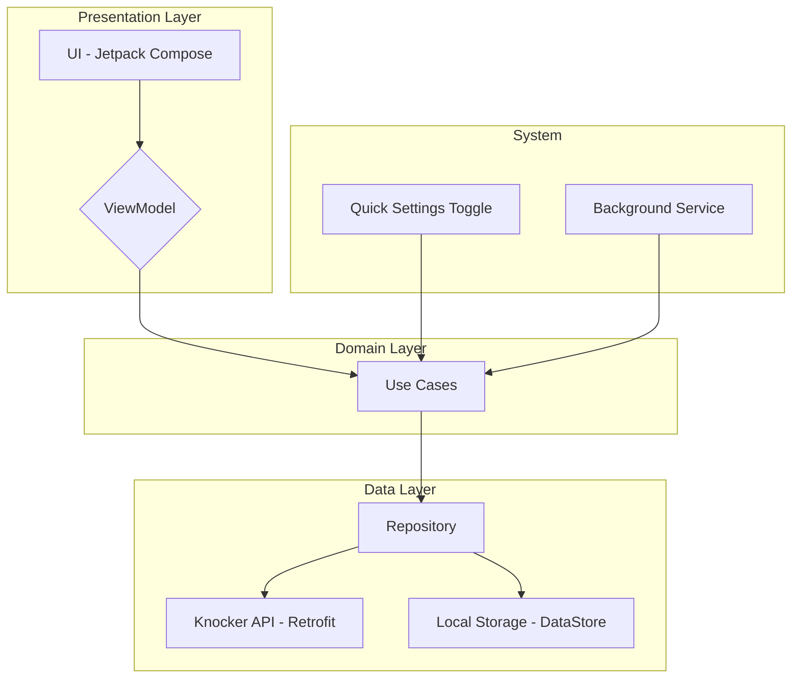

# Knocker Android App Architecture

The Knocker Android app is built using a modern, layered architecture that separates concerns and promotes testability, scalability, and maintainability. The architecture is based on the principles of Clean Architecture and is composed of three main layers: Presentation, Domain, and Data.

## Presentation Layer

The Presentation Layer is responsible for displaying the UI and handling user interactions. It is composed of the following components:

*   **UI (Jetpack Compose):** The UI is built using Jetpack Compose, a modern declarative UI toolkit for Android. The UI is composed of composable functions that are responsible for rendering the UI based on the current state.
*   **ViewModel:** The ViewModel is responsible for holding and managing the UI-related data. It exposes the data to the UI through a `StateFlow` and provides methods for the UI to update the state. The ViewModel communicates with the Domain Layer to perform business logic.

## Domain Layer

The Domain Layer contains the business logic of the application. It is independent of the other layers and is composed of the following components:

*   **Use Cases:** Use cases are responsible for orchestrating the flow of data between the Presentation and Data layers. They contain the business logic and are responsible for a single task (e.g., `WhitelistIpUseCase`, `GetSettingsUseCase`).

## Data Layer

The Data Layer is responsible for providing the data to the application. It is composed of the following components:

*   **Repository:** The repository is responsible for abstracting the data sources. It provides a clean API for the Domain Layer to access the data, regardless of where it comes from (e.g., a remote API or a local database).
*   **Knocker API (Retrofit):** The Knocker API is responsible for communicating with the Knocker backend service. It is implemented using Retrofit, a type-safe HTTP client for Android.
*   **Local Storage (DataStore):** The local storage is responsible for persisting data on the device. It is implemented using Jetpack DataStore, a modern and recommended way to handle simple data persistence.

## System Components

*   **Quick Settings Toggle:** A tile in the quick settings panel that allows the user to quickly whitelist their IP address.
*   **Background Service:** A service that runs in the background to automatically whitelist the IP address when it changes or when the current whitelist is about to expire.